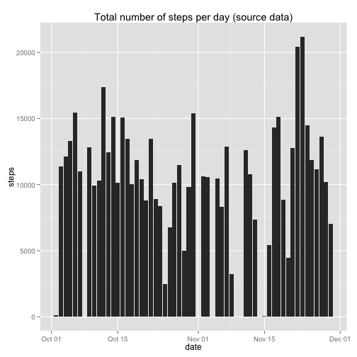
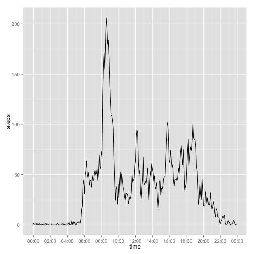
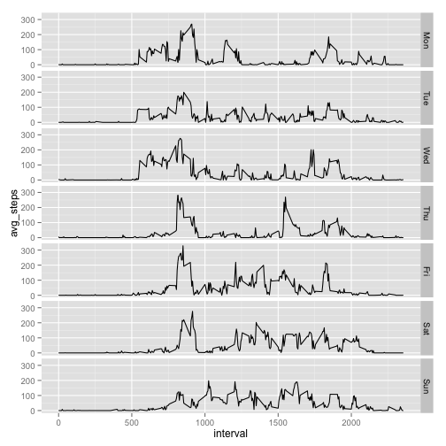
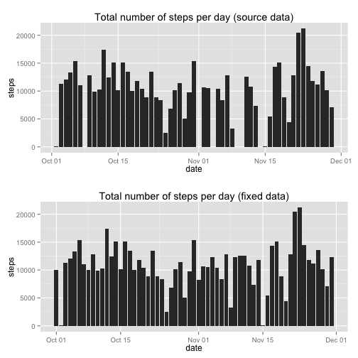
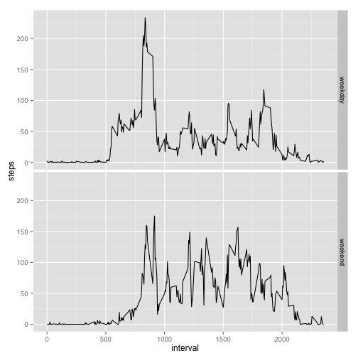

# Reproducible Research: Peer Assessment 1

## Introduction

It is now possible to collect a large amount of data about personal movement using activity monitoring devices such as a Fitbit, Nike Fuelband, or Jawbone Up. These type of devices are part of the “quantified self” movement – a group of enthusiasts who take measurements about themselves regularly to improve their health, to find patterns in their behavior, or because they are tech geeks. But these data remain under-utilized both because the raw data are hard to obtain and there is a lack of statistical methods and software for processing and interpreting the data.

This report makes use of data from a personal activity monitoring device. This device collects data at 5 minute intervals through out the day. The data consists of two months of data from an anonymous individual collected during the months of October and November, 2012 and include the number of steps taken in 5 minute intervals each day.

## Loading and preprocessing the data
In order to load the data we use "activity.zip" file with sample dataset. There is no need to extract data from file since we could create connection directly to the file in it using `unz()` function.

```r
  connection <- unz("activity.zip","activity.csv")
  activity <- read.table(
      file = connection,
      header = TRUE,
      sep = ",")
```
Now let's create new column `$datetime` to store correct timestamp of `steps` measures. It is done by  combining date element from `$date` and time element from `$interval` columns.

```r
  activity$datetime <- as.POSIXct(
    with(
      activity,
      paste(
        date,
        paste(interval %/% 100, interval %% 100, sep=":"))
      ),
      format="%Y-%m-%d %H:%M",tz="")
```
We need some additional libraries to perform advanced plotting.

```r
library(ggplot2)
library(scales)
library(grid)
library(gridExtra)
```
Now let's advance to questions of the assignment.


## What is mean total number of steps taken per day?

To answer this question first we need to find *total number of steps taken per day*:

```r
# calculating data for histogram
stepsPerDay <- setNames(
      aggregate(
          steps~as.Date(date),
          activity,
          sum,
          na.rm = TRUE),
      c("date","steps")
    )

# plotting histogram
hist1 <- ggplot(stepsPerDay,aes(x=date,y=steps)) + 
  geom_bar(stat="identity") + 
  ggtitle("Total number of steps per day (source data)")

print(hist1)
```

 

Now we can look at summary of this totals to find *mean* and *median*:


```r
  summary(stepsPerDay$steps)
```

```
##    Min. 1st Qu.  Median    Mean 3rd Qu.    Max. 
##      41    8840   10800   10800   13300   21200
```

Summary results often lacks accuracy. Using `mean()` and `median()` functions is a more accurate way to find these values. By doing this we get *mean* equal to 10766.2, and *median* equal to 10765. 

```r
  mm_1 <- c(mean = mean(stepsPerDay$steps),median = median(stepsPerDay$steps))
  print(mm_1)
```

```
##   mean median 
##  10766  10765
```

That looks more realistic.

## What is the average daily activity pattern?

Average daily pattern is an average distribution of steps per day by intervals:

```r
avgPattern <- aggregate(steps~interval,activity,mean,na.rm = TRUE)
avgPattern$time <- as.POSIXct(with(avgPattern,paste(interval %/% 100, interval %% 100, sep=":")),format="%H:%M")
plot <- ggplot(avgPattern,aes(x=time,y=steps)) + 
          geom_line() + 
          scale_x_datetime(breaks = date_breaks("2 hour"),labels = date_format("%H:%M"))
print(plot)
```

 

One interval have a peak value. What is number of steps and time for that peak ?

```r
with(avgPattern,avgPattern[steps == max(steps),])
```

```
##     interval steps                time
## 104      835 206.2 2014-07-20 08:35:00
```

## Imputing missing values

Original dataset lacks some data about steps. Let's review what exactly is missing.

```r
mis <- aggregate(cnt~date,cbind(activity[is.na(activity$steps),],cnt=c(1)),sum,na.rm = FALSE)
mis$dow <- weekdays(as.Date(mis$date),abbreviate=TRUE)
print(mis[,c(1,3,2)])
```

```
##         date dow cnt
## 1 2012-10-01 Mon 288
## 2 2012-10-08 Mon 288
## 3 2012-11-01 Thu 288
## 4 2012-11-04 Sun 288
## 5 2012-11-09 Fri 288
## 6 2012-11-10 Sat 288
## 7 2012-11-14 Wed 288
## 8 2012-11-30 Fri 288
```
Quantity of missing measures is 2304 out of 17568.

As we could see, measures for several whole days are missing, and these days are almost all possible days of the week except Tuesday:

```r
unique(mis$dow)
```

```
## [1] "Mon" "Thu" "Sun" "Fri" "Sat" "Wed"
```

As a strategy to fill missing values we could use average value of steps for corresponding interval at corresponding day of the week. First, let's calculate reference dataset for filling gaps:

```r
ref_ds <- aggregate(steps~interval+weekdays(datetime,abbreviate=TRUE),activity,FUN=mean,na.rm=TRUE)
colnames(ref_ds) <- c("interval","dow","avg_steps")
ref_ds$dow <- factor(ref_ds$dow,levels = c("Mon","Tue","Wed","Thu","Fri","Sat","Sun"))
ggplot(ref_ds,aes(x=interval,y=avg_steps)) + geom_line() + facet_grid("dow ~ .")
```

 

As we could see patterns for different days of week differs as well. Adding *day of week* dimension to reference dataset will make replacement more accurate.

Now it is possible to create fixed data set

```r
activity$dow <- weekdays(activity$datetime,abbreviate=TRUE)
af <- merge(activity,ref_ds,by=c("dow","interval"),all.x = TRUE)
af <- af[with(af,order(date,interval)),]
af$fixed_steps <- ifelse(is.na(af$steps),af$avg_steps,af$steps)
```

Now we can compare new data which is fixed by estimated values with source data:

```r
# calculating data set for histogram
  stepsPerDay2 <- setNames(
      aggregate(
          fixed_steps~as.Date(date),
          af,
          sum,
          na.rm = TRUE),
      c("date","steps")
    )
# plotting histogram
hist2 <- ggplot(stepsPerDay2,aes(x=date,y=steps)) + 
  geom_bar(stat="identity") + 
  ggtitle("Total number of steps per day (fixed data)")
# combining with previous
grid.arrange(hist1, hist2, nrow=2)
```

 

Let's review the change of mean and median statistics after fixing gaps.

```r
  mm_2 <- c(mean = mean(stepsPerDay2$steps),median = median(stepsPerDay2$steps))
  comparison <- rbind(source = mm_1, fixed = mm_2, delta = mm_2-mm_1)
  print(comparison)
```

```
##            mean median
## source 10766.19  10765
## fixed  10821.21  11015
## delta     55.02    250
```
We see that mean and median statistics slightly changed. It is expected result as we slightly changed source data.

## Are there differences in activity patterns between weekdays and weekends?

We already saw that day of week patterns differs for original data set. Not let's look at differneces in patterns for working days and weekends.

```r
week_diff <- aggregate(
  steps~dow+interval,  # group steps by weekend/weekday and interval to find average steps 
  with(
    activity,
    data.frame(
      dow = factor(
        ifelse(
          weekdays(as.Date(date)) %in% c("Sunday","Saturday"),
          "weekend",  # if sunday or saturday
          "weekday"   # else
        )
      ),
      interval,
      steps
    )
  ),
  FUN = mean,
  rm.na = TRUE
)
```

Plotting result


```r
  ggplot(week_diff,aes(x=interval,y=steps)) + geom_line() + facet_grid("dow ~ .")
```

 

Again, we see that activity peak on working days that is not so high on weekends. At the same time, on weekends, there is more activity within the day.

